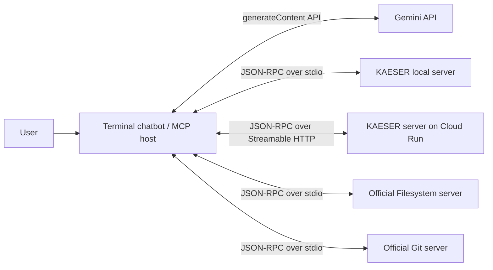

# KAESER MCP Technical Assistant

**Author:** Daniel Chet

**Course:** CC3067 Redes

**Protocol:** Model Context Protocol (MCP) implemented manually with JSON-RPC 2.0

## Overview

This project implements a terminal chatbot that connects to the Gemini API by default, optionally supports the Groq and Claude APIs, and coordinates several MCP servers:

- A custom KAESER industrial compressor assistant over local `stdio`.
- The same custom server over remote Streamable HTTP.
- The official Filesystem MCP server.
- The official Git MCP server.

The MCP client and both transports are implemented manually without an MCP SDK. The chatbot discovers tools, converts their JSON Schemas to LLM function declarations, executes tool calls, returns results to the model, preserves conversation context, and stores a JSONL audit log of every MCP interaction.

The custom server is an academic prototype. It never controls physical machinery. Technical references come from the supplied KAESER documentation; maintenance history, inventory, serial numbers, sensor ranges, and readings are explicitly simulated.

## Architecture



The local and remote KAESER transports share the same tool definitions, validation, request routing, and business logic.

## Implemented requirements

| Requirement | Implementation |
| --- | --- |
| LLM API connection | Raw HTTPS clients for Groq Chat Completions, Gemini `generateContent`, and Claude Messages |
| Conversation context | Complete LLM message and tool-call history is retained during the terminal session |
| MCP interaction log | Timestamped JSONL entries plus the `/log` terminal command |
| Official local servers | Filesystem through `npx`; Git through `uvx` |
| Custom local server | Manual newline-delimited JSON-RPC over `stdin` and `stdout` |
| Custom remote server | Stateless Streamable HTTP JSON responses at `POST /mcp` |
| Cloud deployment | Cloud Run-compatible Dockerfile and PowerShell deployment script |
| Traffic analysis | TLS key logging support plus verified evidence in `Informe_Final_Proyecto_1_Daniel_Chet.docx` |

## Project structure

```text
.
|-- chatbot/
|   |-- scripts/
|   |   |-- check-mcp.js
|   |   `-- setup-demo-workspace.js
|   |-- src/
|   |   |-- transports/
|   |   |   |-- http.js
|   |   |   `-- stdio.js
|   |   |-- anthropic-client.js
|   |   |-- chat-host.js
|   |   |-- config.js
|   |   |-- gemini-client.js
|   |   |-- groq-client.js
|   |   |-- logger.js
|   |   `-- mcp-client.js
|   |-- test/
|   |-- chatbot.js
|   |-- config.example.json
|   `-- package.json
|-- Informe_Final_Proyecto_1_Daniel_Chet.docx
|-- mcp-kaeser-server/
|   |-- data/
|   |-- mcp/
|   |   |-- json-rpc.js
|   |   |-- message-handler.js
|   |   |-- request-handler.js
|   |   |-- tool-definitions.js
|   |   |-- tool-handler.js
|   |   `-- validation.js
|   |-- scripts/
|   |   `-- deploy-cloud-run.ps1
|   |-- test/
|   |-- Dockerfile
|   |-- herramientas.js
|   |-- remote-server.js
|   `-- server.js
`-- README.md
```

## Requirements

- Node.js 18 or newer.
- npm and Git.
- A Gemini API key; Groq and Claude API keys are optional alternatives.
- `npx` for the official Filesystem server.
- `uvx` for the official Git server.
- Google Cloud CLI and a Google Cloud project for deployment.
- Wireshark for the required packet capture.

On Windows, install `uv` and Google Cloud CLI with:

```powershell
winget install --id astral-sh.uv -e
winget install --id Google.CloudSDK -e
```

Open a new terminal after installation.

## Install and test the custom MCP server

```powershell
git clone https://github.com/Dcextrim/CC3067-Redes.git
cd ".\CC3067-Redes\mcp-kaeser-server"
npm install
npm test
```

Start the local stdio server manually:

```powershell
npm start
```

The process waits for newline-delimited JSON-RPC messages. A blank terminal is expected. Press `Ctrl+C` to stop it.

Start the remote HTTP transport locally:

```powershell
$env:MCP_AUTH_TOKEN = "replace-with-a-long-random-token"
$env:PORT = "8080"
npm run start:remote
```

Health check:

```powershell
Invoke-RestMethod "http://localhost:8080/health"
```

## Configure the terminal chatbot

From the repository root:

```powershell
cd ".\chatbot"
npm install
npm run setup:demo
Copy-Item ".\config.example.json" ".\config.json"
```

The generated `demo-workspace` is an isolated Git repository used by the official Filesystem and Git servers. It prevents the demonstration chatbot from changing the project repository itself.

Create an API key in [Google AI Studio](https://aistudio.google.com/app/apikey) and set it only in the current terminal:

```powershell
$env:GEMINI_API_KEY = "your-api-key"
```

The example configuration uses `gemini-3.5-flash-lite`, which was verified with function calling during the final demonstration. The provider and model can also be selected without editing `config.json`:

```powershell
$env:LLM_PROVIDER = "gemini"
$env:GEMINI_MODEL = "gemini-3.5-flash-lite"
```

The manual Gemini REST client automatically retries temporary HTTP `408`, `429`, and `5xx` failures, connection resets, DNS lookup failures, and timeouts with exponential backoff.

Groq and Anthropic remain available as optional providers. Set `llm.provider` or `LLM_PROVIDER` to `groq` or `anthropic` and provide the corresponding environment variable. To remain within Groq Free Plan token limits, its adapter selects at most eight relevant tool schemas per request instead of resending all discovered schemas.

Never write API keys into `config.json` or commit them to Git.

Check all enabled MCP connections without calling the LLM API:

```powershell
npm run check:mcp
```

Start the chatbot:

```powershell
npm start
```

### Terminal commands

| Command | Purpose |
| --- | --- |
| `/help` | Show available commands |
| `/tools` | Show every tool discovered from connected MCP servers |
| `/log 20` | Display the last 20 MCP log entries |
| `/clear` | Clear conversation context |
| `/exit` | Close MCP child processes and exit |

## Use the remote KAESER server

Deploy the service first, then set these variables in the chatbot terminal:

```powershell
$env:KAESER_REMOTE_URL = "https://YOUR-SERVICE-URL/mcp"
$env:MCP_AUTH_TOKEN = "the-same-token-used-during-deployment"
```

Edit `chatbot/config.json` and change `kaeser_remote.enabled` to `true`. To prove that the host is using the cloud service, change `kaeser_local.enabled` to `false` during the remote demonstration.

Run:

```powershell
npm run check:mcp -- --config config.json
npm start
```

## Deploy to Google Cloud Run

Authenticate and select or create a billing-enabled Google Cloud project:

```powershell
gcloud init
gcloud auth login
```

On newer Google Cloud projects, Cloud Build uses the Compute Engine default service account. Grant that account the least-privileged Cloud Run Builder role required for source deployments:

```powershell
$projectId = "YOUR_PROJECT_ID"
gcloud config set project $projectId
$buildServiceAccount = (gcloud builds get-default-service-account --project $projectId).Trim()
gcloud projects add-iam-policy-binding $projectId `
  --member="serviceAccount:$buildServiceAccount" `
  --role="roles/run.builder"
```

IAM changes can take a few minutes to propagate.

Generate a temporary academic-demo token:

```powershell
$tokenBytes = New-Object byte[] 32
$rng = [Security.Cryptography.RandomNumberGenerator]::Create()
$rng.GetBytes($tokenBytes)
$rng.Dispose()
$env:MCP_AUTH_TOKEN = [Convert]::ToBase64String($tokenBytes)
```

From the repository root, run:

```powershell
.\mcp-kaeser-server\scripts\deploy-cloud-run.ps1 -ProjectId $projectId
```

The script enables the required APIs, deploys the Dockerfile from source, verifies `/health`, and prints the public `/mcp` URL. The Cloud Run service is publicly invokable at the infrastructure layer, but the application requires the Bearer token when `MCP_AUTH_TOKEN` is configured.

For a long-lived deployment, store the token in Google Secret Manager instead of a plain environment variable.

### Verified academic deployment

- Project: `cc3067-proyecto1`
- Region: `us-central1`
- Service: `kaeser-mcp`
- Revision used for the final validation: `kaeser-mcp-00002-g27`
- Health URL: `https://kaeser-mcp-690519080181.us-central1.run.app/health`
- MCP URL: `https://kaeser-mcp-690519080181.us-central1.run.app/mcp`

## MCP transports

### Local stdio

- The client launches `server.js` as a subprocess.
- UTF-8 JSON-RPC messages are delimited by newlines.
- Protocol output is written only to `stdout`.
- The client correlates responses by JSON-RPC request ID.

### Remote Streamable HTTP

- MCP endpoint: `POST /mcp`.
- Each JSON-RPC message is sent in a separate HTTP request.
- Client `Accept`: `application/json, text/event-stream`.
- Server response mode: JSON-only and stateless.
- Accepted notifications receive HTTP `202` with an empty body.
- `GET /mcp` returns `405` because this implementation does not open an SSE listening stream.
- Subsequent requests include `MCP-Protocol-Version`.
- Optional Bearer authentication uses `MCP_AUTH_TOKEN`.
- Incoming `Origin` headers are rejected unless listed in `ALLOWED_ORIGINS`.

## Custom KAESER tools

| Tool | Required arguments | Result |
| --- | --- | --- |
| `consultar_specs` | `modelo: string` | Family, configuration, pressure, flow, power, dimensions, source |
| `diagnosticar_falla` | `codigo_mensaje: string`, `modelo: string` | Description, causes, actions, authorized-service flag |
| `calcular_mantenimiento_pendiente` | `numero_serie: string`, `horas_operacion: number >= 0` | Status, next service, remaining or overdue hours |
| `consultar_disponibilidad_repuesto` | `numero_parte: string` | Quantity, warehouse, replenishment date |
| `registrar_lectura_sensor` | `numero_serie`, `tipo`, `valor`, `unidad` | Timestamp, configured range, alert level, persistence result |

Model and identifier searches are case-insensitive. Demonstration serial numbers are `KC-2291` and `KC-4402`. Demonstration parts are `FA-330` and `FS-10`.

## Demonstration prompts

General LLM and context:

```text
Who was Alan Turing?
In what year was he born?
```

Custom local or remote MCP server:

```text
Use the KAESER tools to show the complete specifications of the SM 13.
The SM 13 displays code 0044 A. What should a technician inspect?
Equipment KC-2291 has 5900 operating hours. Does it need service soon?
```

Official Filesystem and Git servers:

```text
Inside the authorized demo-workspace, create a README.md describing a compressor maintenance demo. Then use the Git tools to stage it, commit it with the message "docs: add demo readme", and show the repository log.
```

Review `/log` after every scenario to demonstrate the JSON-RPC requests, notifications, and responses.

## MCP interaction logs

Each chatbot session creates:

```text
chatbot/logs/mcp-<timestamp>.jsonl
```

Every line contains:

- UTC timestamp.
- Server name.
- Transport (`stdio` or `http`).
- Direction (`sent` or `received`).
- Category (`json-rpc`, `http-status`, `http-error`, or `stderr`).
- Complete JSON-RPC message or transport status.

Secrets and HTTP authorization headers are never written to this log.

## Wireshark capture

The remote client can export TLS session secrets when `TLS_KEYLOG_FILE` is set. This allows Wireshark to decrypt the student's own HTTPS session and inspect the JSON-RPC exchange. The verified capture, request/response frame table, and layer analysis are consolidated in `Informe_Final_Proyecto_1_Daniel_Chet.docx`.

Never commit TLS keys or an unredacted capture because decrypted authorization headers contain the temporary Bearer token.

## Testing

Run both test suites:

```powershell
cd ".\mcp-kaeser-server"
npm test
cd "..\chatbot"
npm test
```

The tests cover:

- All five custom business tools.
- Local stdio framing and error behavior.
- Remote HTTP status, authentication, origin, version, and tool calls.
- Manual MCP clients for both transports.
- Groq, Gemini, and Claude API request formats.
- Tool-use/tool-result orchestration.
- Conversation context.
- JSONL interaction logs.

No live LLM API key or cloud project is required by the automated tests.

## Local persistence and Cloud Run limitation

Local sensor readings are appended to `mcp-kaeser-server/data/lecturas.json`, which is ignored by Git. Remote readings use `/tmp/kaeser-lecturas.json` inside the Cloud Run container. Cloud Run storage is ephemeral and instance-local; therefore remote sensor persistence is suitable only for this demonstration. A production design would use a durable database such as Firestore or Cloud SQL.

## Safety and security

- The project does not control real compressor equipment.
- Follow the official equipment manual and plant procedures.
- Never commit `GROQ_API_KEY`, `GEMINI_API_KEY`, `ANTHROPIC_API_KEY`, `MCP_AUTH_TOKEN`, TLS key logs, or decrypted captures.
- Restrict the Filesystem server to `demo-workspace`.
- Rotate the remote Bearer token after a Wireshark demonstration.
- Use Google Secret Manager for a persistent deployment.

## Data sources

| Data | Reference |
| --- | --- |
| SXC models | `SXC-Series.pdf`, Technical specifications |
| SX and AIRCENTER 3-8 | `SX-Series.pdf`, Technical specifications |
| SM, SM SFC, AIRCENTER 10-16 | `SM-Series.pdf`, Technical specifications |
| SK, SK SFC, AIRCENTER 22-25 | `SK-Series.pdf`, Technical data |
| ASK, ASK SFC, ASK T SFC | `ASK-Series.pdf`, Technical data |
| Fault codes | `SIGMA CONTROL 2 SCREW FLUID >=4.5.X`, section 10.2, pages 195-197 |

Maintenance history, inventory, sensor limits, serial numbers, and readings are simulated and are not official KAESER data.

## Final report

`Informe_Final_Proyecto_1_Daniel_Chet.docx` consolidates the server specification, cloud deployment, real protocol analysis, test evidence, difficulties, and conclusions. Internal Markdown guides, raw images, logs, and packet captures are intentionally excluded from version control.

## License

ISC
